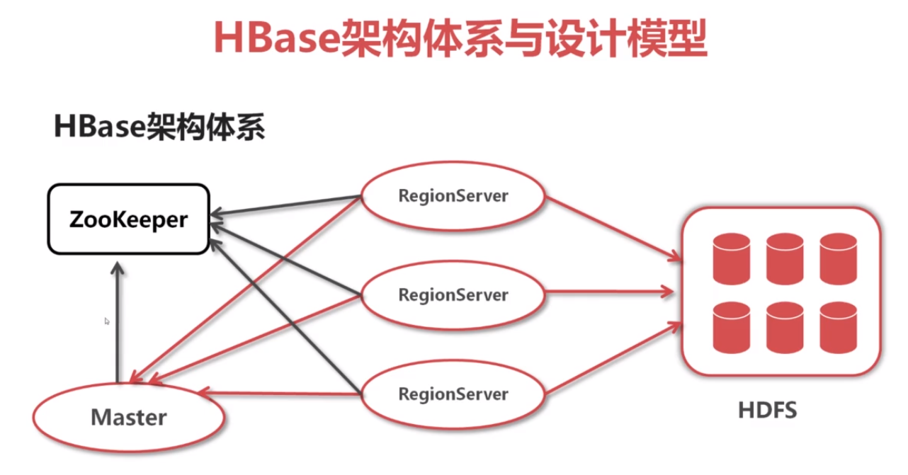
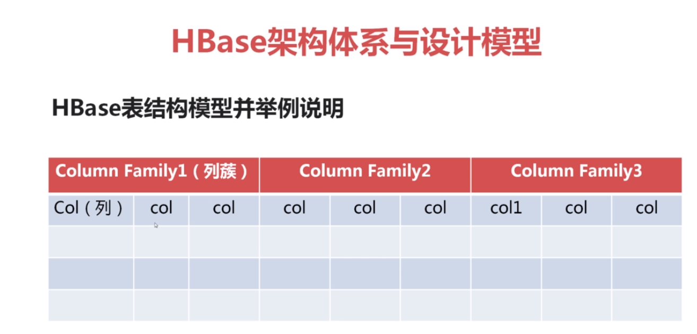
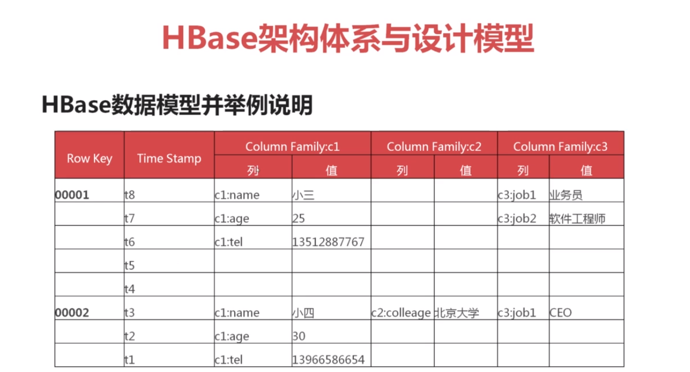
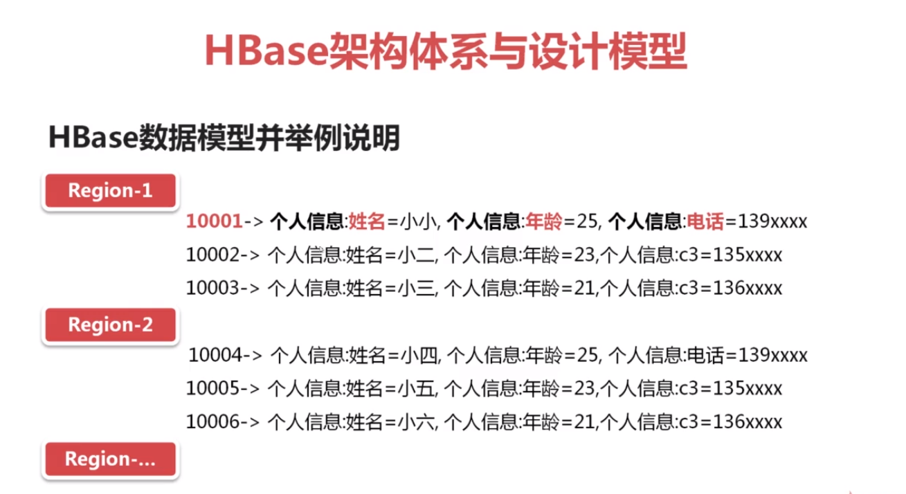
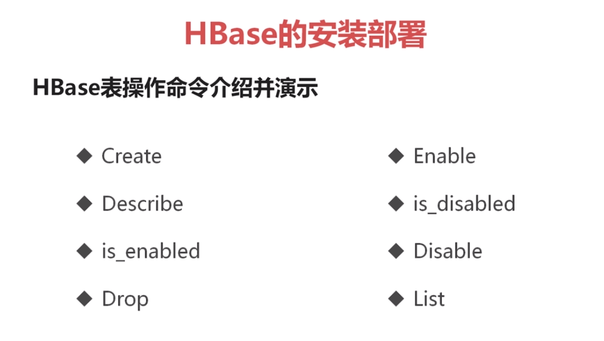
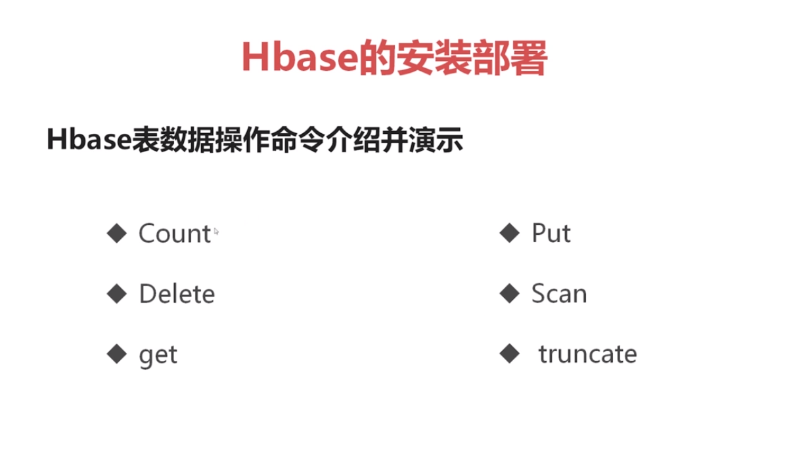

#### HBase 入门
* 适合大数据量(单表可以有百亿行,百万列)/实时查询(毫秒级延迟)/高并发读取

* 面向列的存储和权限控制,并支持独立检索,列式存储,其数据在表中是按照某列存储的,
这样在查询只需要少数几个字段的时候,能大大减少读取的数据量.

* 每个列的数据存储可以有多个version

* 为空的列不占用存储空间,表可以设计的非常稀疏.
RDBMS是需要填充null的,而HBase列为空,就是连那个列都没有

* 底层依赖于HDFS

* 高可靠性:WAL机制保证了数据写入时不会因集群异常而导致写入数据丢失;
Replication机制保证了集群出现严重问题时,数据不会丢失或损坏,
而且HBase底层使用HDFS,HDFS本身也有备份.

* 高性能:底层的LSM(树型)数据结构和Rowkey有序排列等架构上的独特设计,使Hbase具有
非常高的写入性能.region切分(自动分区)/主键索引和缓存机制使得Hbase在海量数据下具备一定的
随机读写性能.该性能针对rowkey的查询能达到毫秒级别延迟.

* 不支持条件查询

#### HBase架构体系

* RegionServer类似HDFS的DataNode,管理各自的数据.

#### HBase设计模型
* 建表时无需指定列,只需要指定列簇;将若干列划为一类

* 下面是表结构的设计模型.row key表示一个主键.
每个主键下不止一个列.

* 列簇:
    * 一张表列簇不超过5个,越少越好
    * 每个列簇中的列数没有限制
    * 列只有插入数据后才存在
    * 列在列簇中是有序的.
    
* regionServer会管理各自分区的数据.可以在写入时指定分配给哪个regionserver.
也可以让它自动分配

#### HBase安装
* 首先需要安装好zookeeper.此处不赘述zookeeper的安装

>
    此处提前安装好了单机的zookeeper.
    解压.
    
    配置hbase-env.sh
    export JAVA_HOME=xxx
    export HBASE_MANAGES_ZK=false  (如果不修改该项,hbase会使用它自带的zookeeper(我去.那我还安装个鸡儿啊))
    
    配置hbase-site.xml(具体配置,官方文档有详细说明),如果多台zookeeper,就用逗号分割
      <property>
        <name>hbase.rootdir</name>
        <value>hdfs://hadoop000:8020/hbase</value>
      </property>
      <property>
        <name>hbase.cluster.distributed</name>
        <value>true</value>
      </property>
      <property>
        <name>hbase.zookeeper.quorum</name>
        <value>hadoop000</value>
      </property>
      <property>
        <name>hbase.tmp.dir</name>
        <value>/zx2/habse-1.4.0/data/tmp</value>
      </property>      
      
    
    配置regionservers文件,也在conf目录下,
    在单机模式下,直接将自己的主机名写上去即可(默认就是localhost)
    
    还可以配置环境变量
    export HBASE_HOME=/zx2/hbase-1.4.0
    export PATH=${HBASE_HOME}/bin:$PATH
    
    启动(启动前需要先启动zookeeper和hdfs)
    start-hbase.sh
    成功后,jps可以看到
    HRegionServer和HMaster
    
    web页面
    ip:16010(1.X前的端口貌似是60010)
    
    很少有这么一长串的安装过后,不报一个错的的.....突然有点不习惯...
>

#### HBase Shell 使用
表操作

* 进入控制台: ./bin/hbase shell
如果需要提示,例如直接输入一个create.回车. 他会有帮助信息
>
    创建表 test1是表名,info是列簇名
    create 'test1','info'
    
    list 查看所有表
    
    查看test1表的数据
    scan 'test1' 
    
    查看表信息
    describe 'test1'
    
    禁用表
    disable 'test1'
    删除表(禁用后才能删除)
    drop 'test1'
    判断表是否启用 
    is_enabled 'test1'
    
    在test1表中,增加了rowkey为0001的,在列簇info中,增加了username为zx的记录
    put 'test1','0001','info:username','zx'
>

表数据操作

