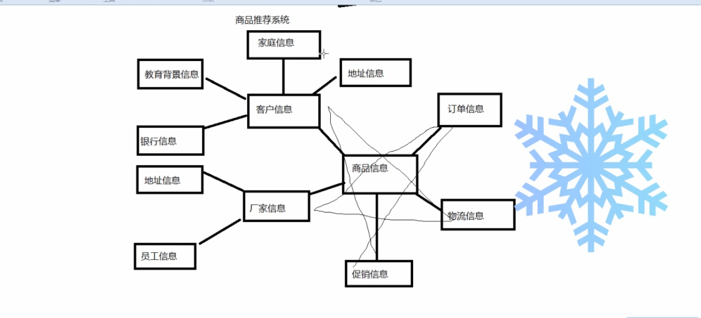
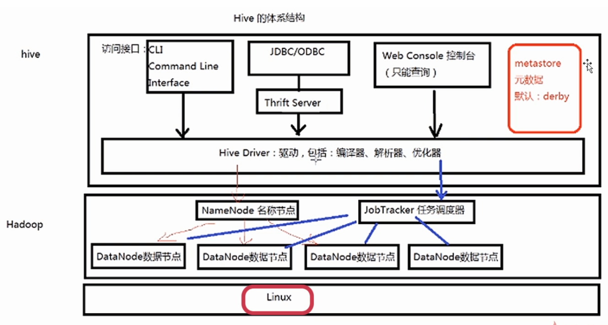
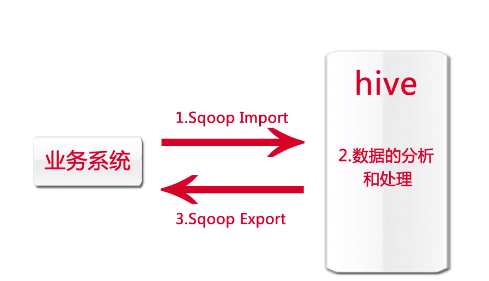
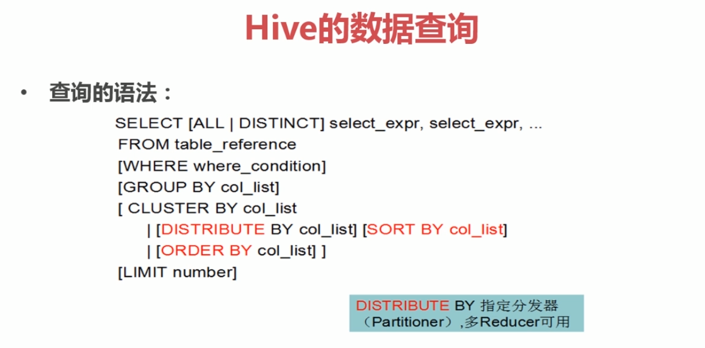
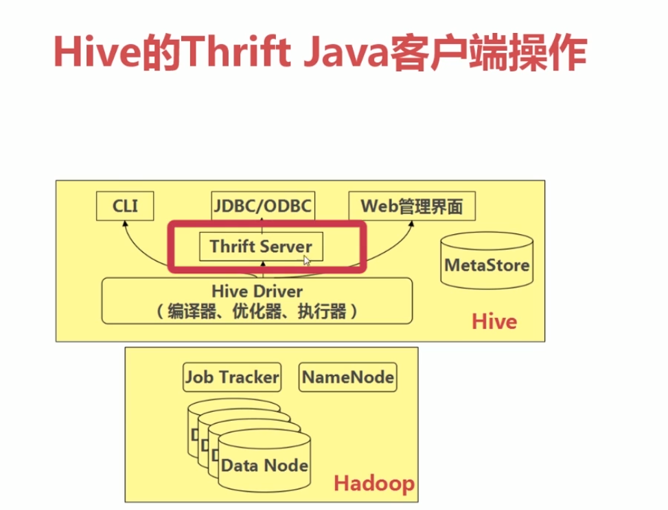

#### Hive入门
* 传统数据仓库  
    * 面向主题的(例如商品推荐,主题就是商品)/集成的(元数据来自mysql或文件等其他地方)/不可更新的(主要操作就是查询)/随时间不变化的数据集合.
    * 数据仓库的结构和建立过程
        * 数据源(DB/文件/其他)
        * 把数据源的数据抽取出来,转换,然后存入数据仓库
        * 数据仓库引擎
    * OLTP应用(事务)
    * OLAP应用(面向查询)
    
    * 数据仓库中的数据模型
        * 星型模型
            * 例如搭建一个商品推荐系统.
        * 雪花模型(基于星型继续扩展)
        
        
* Hive
    * 基于Hadoop HDFS之上的数据仓库
    * 可以通过数据提取转换加载(ETL)
    * Hive提供了简单的类似SQL的查询语言,称为HQL.
    * Hive允许熟悉MapReduce开发者开发自定义的mapper和reducer
    来处理内建的mapper和reducer无法完成的复杂的分析任务
    * Hive是SQL解析引擎,她将SQL语句转换成MapReduce Job执行
    * Hive的表/数据,其实就是HDFS的目录/文件

* Hive的元数据
    * Hive将元数据存储在数据库中(metastore),支持mysql/derby(默认)/oracle等
    * 元数据包括表的名字/列/分区和其他属性/表的属性(是否为外部表等)/表的数据所在目录等
    * 可以与SparkSQL等相互共享数据

* 一条HQL如何执行  
解释器/编译器/优化器完成HQL语句从词法分析/语法分析/编译/优化.以及查询计划(Plan,类似.java - .class)的生成.  
生成的查询计划存储在HDFS中,随后在MapReduce调用执行

* Hive体系结构

* 由Facebook开源,最初用于解决海量结构化的日志数据统计问题
* Hive底层的执行引擎有:MapReduce/Tez/Spark
* 压缩: GZIP/LZO/Snappy/BZIP2
* 存储: TextFile/SequenceFile/RCFile/ORC/Parquet

#### bug
* hive中有许多保留子,如果用来作为表名/列名会出错,例如user (一句mmp不知当不当讲.)

#### Hive安装
* 嵌入模式
    * 元数据被保存在hive自带的derby仓库中
    * 只允许创建一个连接,多用于deno
    >
        解压.
        运行./bin/hive 即可进入控制台.
        无需任何配置
    >
* 本地模式
    * 元数据信息被存在了Mysql数据库中,
    * Mysql数据库和Hive运行在一台服务器上
* 远程模式
    * 同本地模式,但mysql和hive不在同一服务器上
>
    下载mysql连接的jar到hive的lib下.
    在conf目录下.参考hive-default.xml.template新建 hive-site.xml
    <?xml version="1.0" encoding="UTF-8" standalone="no"?>
    <?xml-stylesheet type="text/xsl" href="configuration.xsl"?>
    <configuration>
        <property>
            <name>javax.jdo.option.ConnectionURL</name>
            <value>jdbc:mysql://rm-uf65k2dia4943tqe25o.mysql.rds.aliyuncs.com:3306/hive?useSSL=false</value>
        </property>
        <property>
            <name>javax.jdo.option.ConnectionDriverName</name>
            <value>com.mysql.jdbc.Driver</value>
        </property>
        <property>
            <name>javax.jdo.option.ConnectionUserName</name>
            <value>root</value>
        </property>
        <property>
            <name>javax.jdo.option.ConnectionPassword</name>
            <value>ZhengXing36</value>
        </property>
    </configuration>
    
    参考hive-env.sh.template新建 hive-env.sh
        配置 HADOOP_HOME=xxx
    
     配置环境变量
     将hive初始化 
     schematool -dbType mysql -initSchema
    (我因为hive-site.xml里面的单词写错了..一直给我报脚本错误啥的...)
    
    运行 hive
    ./bin/hive
>

#### Hive的启动方式
* CLI(命令行)方式,都需要分号
>
    直接输入./bin/hive (quit退出)
    或 hive --service cli (exit退出)当然还有ctrl + c退出
    或 hive -S 进入静默模式,不显示调试的log(例如mapreduce的信息)
    或 hive -e '语句';      直接执行
    清屏 
        CTRL + L 或 !clear
    查看表
        show tables;
    查看内置函数
        show functions
    查看表结构
        desc 表名
    查看HDFS上的文件
        dfs -lsr 目录
    执行操作系统命令
        -!命令
    执行hql语句
        select *** from ***
    执行sql脚本
        source sql文件
        
>

* Web界面方式:hwi.已被移除

* 远程服务启动方式,下面是hiveserver2的例子
如果要用jdbc登录到hive中操作数据,必须要启动远程服务,注意,默认jdbc端口是10000,  
hive.server2.webui.port是web界面的端口.
访问ip:port查看web界面
>
        使用如下命令运行
            hive --service hiveserver2 & 
        端口和ip配置,在hive-site.xml中.如下(0.0.0.0外网才能访问,)
            <property>
                <name>hive.server2.webui.host</name>
                <value>0.0.0.0</value>
            </property>
            <property>
                <name>hive.server2.webui.port</name>
                <value>10002</value>
            </property>
    >

#### Hive数据类型
>
    基本数据类型
        tinyint/smallint/int/bigint :整数
        float/double/decimal: 浮点
        boolean : 布尔
        string/varchar/char : 字符
    
    复杂数据类型
        Arrat: 数组
        Map: key/value集合
        Struct: 结构类型(对象),可以包含不同数据类型的元素.这些元素可以通过"点语法"的方式获取
    
    时间类型
        Date:
        Timestamp
        
    例子
    create table a(
        id int,
        grade array<float>
    );
    {1,[30.2,19.2,34.4]}
    
    create table b(
        id int,
        name  string,
        grade map<string,float>
    );
    {1,'zhengxing',<'语文',90.3>}
    
    create table c(
        id int,
        name string,
        grades array<map<string,float>>
    );
    {1,'zhengxing',[<'语文',90>,<'数学',80>]}
    
    create table d(
        id int,
        info struct<name:string,age:int,sex:string>
    );
    {1,{'zhengxing',20,'男'}}
    
    Date和Timestamp区别
        timestap:和时区无关,只是从公元某年到现在的毫秒数
        date:该date只包含日期.没有时分秒
>

#### Hive数据存储
* hive的数据被保存在hdfs的/user/hive中,并且表没有专门的存储格式.(默认一个表貌似就是一个txt,然后按照行列排开,制表符为列分隔符)
* 存储结构主要包括:数据库/文件/表/视图
* 可以直接加载文本文件(.txt文件等)
* 创建表时,可以指定hive数据的 列分隔符和行分隔符

* 表
    * Table:内部表
    >
        和数据库中的表类似.
        每个table在hive中都有一个相应的目录存储数据
        所有的table数据(不包括External Table)都保存在该目录中
        删除表示,元信息和 表数据都会被删除
        
        如下.可以指定表数据保存在hdfs中的位置
        create table t2(
            id bigint,
            name varchar(20),
            age int
        )location '/zx/hive/t2';
        
        如下,可以指定行分隔符为','
        create table t2(
            id bigint,
            name varchar(20),
            age int
        )row format delimited fields terminated by ','
    >
    
    * Partition:分区表
    >
        Partition对应于数据库的Partition列的密集索引
        在Hive中,表的一个Partition对应于表下的一个目录,所有的Partition的数据都存储在对应目录中
        
        例如已有一个用户表,可以根据性别,创建出一张分区表.再将用户表的数据插入分区表.这样查询性别的时候可以提高效率.
        分区表的字段可以和用户表原来的字段不一样.只需要插入的时候插入对应的即可
        
        创建分区表
        create table partition_table(
            id bigint,name string        
        )partitioned by (gender string);
        将用户表的数据插入到分区表的 性别为男的分区中
        insert into table partition_table partition(gender='男') select id,name from user where gender='男';
        然后再将性别换成女,就又插入到了另一分区中
        
        可以通过如下,查看一个语句的执行计划(例如是扫描索引,还是扫描全表之类的)
        explain 其他语句
    >
    * External Table:外部表
    >
        指向已经在HDFS存在的数据,可以创建Partition
        它和内部表在元数据的存储上是相同的,但实际数据的存储则有较大差异
        
        外部表,只有一个过程.加载数据和创建表同时完成.不会把外部数据移动到hive的自己的仓库目录中.
        只是和外部数据建立一个连接.当删除一个外部表时,仅删除该链接
        
        如下,就创建了一个外部表.注意./input目录下可以有多个文件,该表会自动聚合所有的文件内容到该表中.
        如果删除其中一个文件.就会丢失一部分数据
        external table external_table(
            idint, name string
        )
        row format delimited fields terminated by ','
        location '/input'
    >
    
    * Bucket Table 桶表
    >
        对数据进行哈希取值,然后放到不同的文件中存储
        把指定列的哈希相同的值存到一个桶中
        
        创建根据name进行哈希的有5个桶的桶表
        create table bucket_table(
            id bigint,
            name varchar(20)
        )clustered by(name) into 5 buckets;
    >
    * 视图
    >
        视图是一个虚表,是一个逻辑概念,可以跨越多张表
        视图建立在已有表的基础上,视图依赖以建立的这些表称为基表
        视图最大的好处就是简化复杂的查询
        hive不支持物化视图(也就是可以存入数据的视图)
        
        如下建立视图
        create view view_table
        as
        select e.name,d.age
        from emp e,dept d
        where e.id = d.sid;
    >

#### Hive数据导入
* 使用load语句
>
    
    [LOCAL] 如果写,表示从操作系统文件导入,不写,表示从hdfs导入
    [OVERWRITE] 表示是否覆盖表中存在的数据 
    [PARTITION  (xxx=val1,xxx=val2...)] 如果是分区表,可以这样指定导入到哪个分区
    导入的文件路径可以只是一个目录.会自动导入该目录下所有的数据文件
    
    LOAD DATA [LOCAL] INPATH 'filepath' [OVERWRITE] 
    INTO TABLE tablename [PARTITION  (xxx=val1,xxx=val2...)]
    
    如下,将三条数据导入表,注意,该表需要是用','为列分隔符.默认为制表符
    1,zhengxing,10
    2,xxx,10
    3,aaa,10
    load data local inpath '/zx2/a.txt' into table tt
>

* 使用insert,需要版本稍高才支持
>
    从官网复制过来的.仔细看就懂了.不再赘述
    
    将查询出来的数据导入一张表
    INSERT OVERWRITE TABLE tablename1 [PARTITION (partcol1=val1, partcol2=val2 ...) [IF NOT EXISTS]] select_statement1 FROM from_statement;
    INSERT INTO TABLE tablename1 [PARTITION (partcol1=val1, partcol2=val2 ...)] select_statement1 FROM from_statement;
    
    直接新增数据到表
    INSERT INTO TABLE tablename [PARTITION (partcol1[=val1], partcol2[=val2] ...)] VALUES values_row [, values_row ...]
    
    将表中数据导出成文件
    INSERT OVERWRITE [LOCAL] DIRECTORY directory1
    [ROW FORMAT row_format] [STORED AS file_format] (Note: Only available starting with Hive 0.11.0)
    SELECT ... FROM ...
>

* 使用Sqoop实现数据导入
>
    Sqoop:Apache下的一个框架,专门用来做数据的导入和导出
    安装
    直接解压即可
    然后配置两个环境变量,在sqoop/conf/sqoop-env.sh中(他有个模版为sqoop-env-template.sh)
    export HADOOP_COMMON_HOME=/zx2/hadoop-2.7.5
    export HADOOP_MAPREDUCE_HOME=/zx2/hadoop-2.7.5
    然后将mysql连接的jar上传到lib目录中
    默认版本会缺少jar,可以直接下载sqoop的hadoop.tar.gz压缩包.里面有缺少的jar
    (备注下.上面这个bug的解决方式是自己发现的.网上都是说自己去编译出来.问题是编译需要ant...懒惰使我进步)
    
    将mysql数据导入到hdfs中. -m表示线程数, --target-dir表示hdfs的目录(注意.下面的语句需要在同一行.不能有回车间隔)
    ./sqoop import --connect jdbc:mysql://rm-uf65k2dia4943tqe25o.mysql.rds.aliyuncs.com:3306/test 
    --username root --password ZhengXing36 --table test1 --columns 'id,name,age' 
    --m 1 --target-dir '/sqoop/test1'
    
    将mysql数据导入到hive中,也可以不指定表名.会自动创建同名的表
    ./sqoop import --hive-import --connect jdbc:mysql://rm-uf65k2dia4943tqe25o.mysql.rds.aliyuncs.com:3306/test 
    --username root --password ZhengXing36 --table test1 --columns 'id,name,age' --m 1 --hive-table t1
    
    将mysql数据导入到hive中,使用where条件 
    --where 'age > 10'
    
    将mysql数据导入到hive中,使用查询语句(' AND $CONDITIONS'必须这么写,不然会报错)
    ./sqoop import --hive-import --connect jdbc:mysql://rm-uf65k2dia4943tqe25o.mysql.rds.aliyuncs.com:3306/test 
    --username root --password ZhengXing36  --columns 'id,name,age' --m 1 --hive-table t1
    --query 'select * from t1 where age > 0 AND $CONDITIONS'  
    
    将hive数据(也就是HDFS数据)导出到mysql中 ,--export-dir表示hive要导出的数据在hdfs中的位置,注意,要现在mysql中创建对应的表
    ./sqoop export --connect jdbc:mysql://rm-uf65k2dia4943tqe25o.mysql.rds.aliyuncs.com:3306/test --username root --password ZhengXing36 --m 1 --table t1 --export-dir /user/hive/warehouse/t1
>

#### Hive在工作中的处理流程

#### Hive的数据查询
* 简单查询
>
    和sql大致没差.
    但,像如下查询.如果a或b一个为null.第三个表达式字段就会为null
    select a,b,a*b from t1;
    如下,可以把其转换为0
    select a,b,a*b+nvl(comm,0) from t1;
    判断一个值是否为空,无论是sql或hql都需要如下判断
    select a,b,a*b+nvl(comm,0) from t1 where a si null;
>

* 过滤和排序

* hive的函数
    * 内置函数
        * 数学函数
        >
            round:四舍五入
                round(45.926,2) = 45.93 
                round(45.926,1) = 45.9
                round(45.926,-1) = 50
                round(45.926,-2) = 0
            ceil:向上去整
            floor:向下去整 
        >
        * 字符函数
        > lower/upper/length/concat/substr/trim/lpad/rpad
        * 收集函数
        > size 返回map集合的长度
        * 转换函数 
        > cast ,例如 cast(1 as bigint) cast( '2017-11-11' as date )
        * 日期函数
        > to_date/year/month/day/weekofyear/datediff/date_add/date_sub
        * 条件函数
        >
            coalesce: 从左到右返回第一个不为null的值 
            
            case... when... : 条件表达式
            case a when b then c [when d then e] * [else f] end
        >
        * 聚合函数
        > count/sum/min/max/avg
        * 表生成函数
        > explode 把一个map或array单独生成行

* 表连接
>
    和sql的不同
    内连接 inner join -> join
    左右外连接 left join -> left outer join
>        
* 自查询
>
    hive只支持from和where字句中的子查询
>

#### Hive自定义函数
Hive的自定义函数(UDF):User Defined Function
可以直接应用与select语句,对查询结果做格式化处理后,再输出内容

* 自定义UDF需要继承org.apache.hadoop.hive.ql.UDF
* 需要实现evaluate函数,evaluate函数支持重载
* 把程序打包放到目标机器上去
* 进入hive客户端,添加jar:
> hive>add jar /xxx/xxx.jar
* 创建临时函数
> hive>create temporary function <函数名> as 'java类名';
* 删除临时函数
> hive>drop temporary function <函数名>
#### Java操作Hive
* 需要启动之前提到的hiveserver2.
>  hive --service hiveserver2 & 

* JDBC
>
    添加依赖
    
    
    如果遇到bug: User: root is not allowed to impersonate anonymous
    在hadoop的core-site.xml中增加
    <property>
          <name>hadoop.proxyuser.root.groups</name>
          <value>*</value>
          <description>Allow the superuser oozie to impersonate any members of the group group1 and group2</description>
     </property>
     
    <property>
          <name>hadoop.proxyuser.root.hosts</name>
          <value>*</value>
          <description>The superuser can connect only from host1 and host2 to impersonate a user</description>
    </property>
    并修改连接Connection的获取方式为:
    DriverManager.getConnection(url,"root","root");
>

* Thrift Client

#### Hive实现单词统计
1. 创建单词统计表,用content字段存储string类型的单词文本
create table hive_wordcount(content String);
1. 将单词文本从file导入hive的表
load data local inpath '/xxx' into table hive_wordcount
3. 执行sql,统计;   
//lateral view explode() : 该函数是把每行记录按照指定分隔符拆解,此处是制表符; 结果为ws,然后再起个别名为word
//然后再按照单词分组
select word,count(1) from hive_wordcount lateral view explode(split(content, '/t')) wc as word  group by word;

提交指定后会生成MapReduce,并在YARN上生成作业.

#### 注意
hive cli 已经过时, 可以使用 beeline   
先启动hiveserver2.   
然后启动beeline: hive --service beeline  
启动后,连接到hiveserver2 : !connect jdbc:hive2://106.14.7.29:10000/default 并输入用户名密码, root root
hive放入lib包的mysql版本要稍高些,否则执行load等命令时会有错误提示.

    