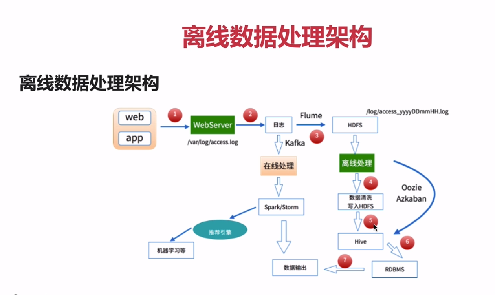
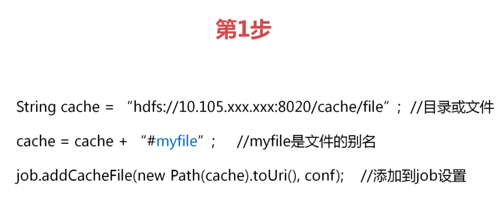
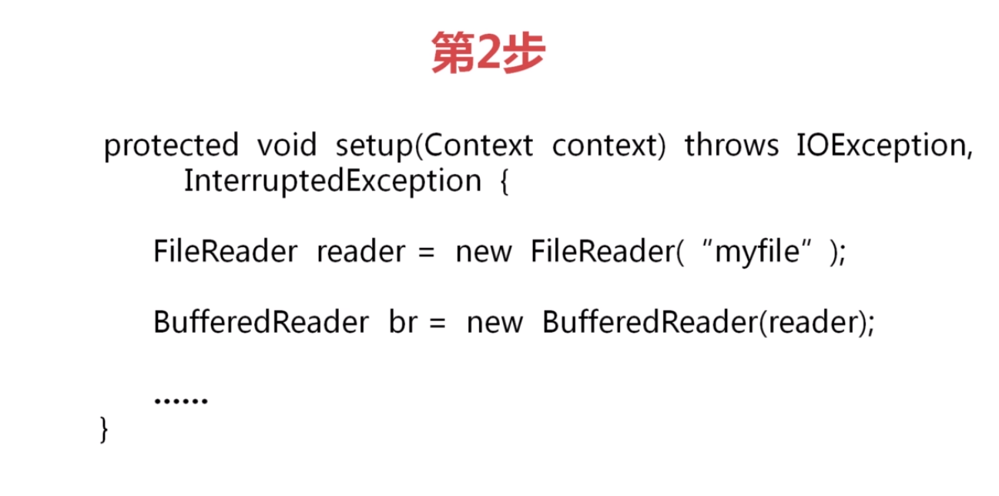
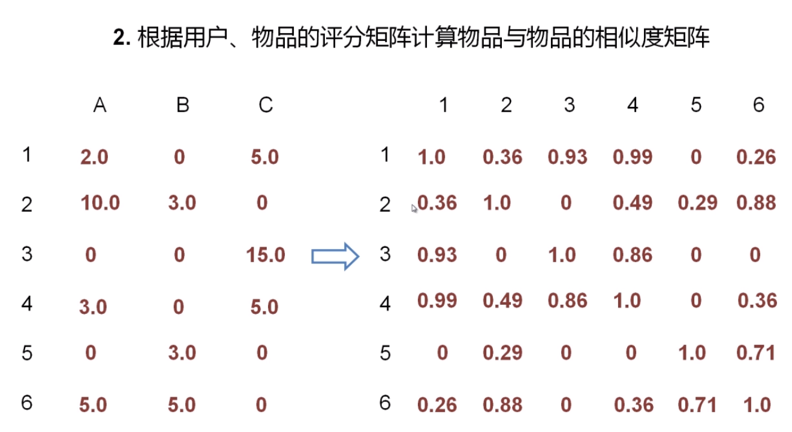
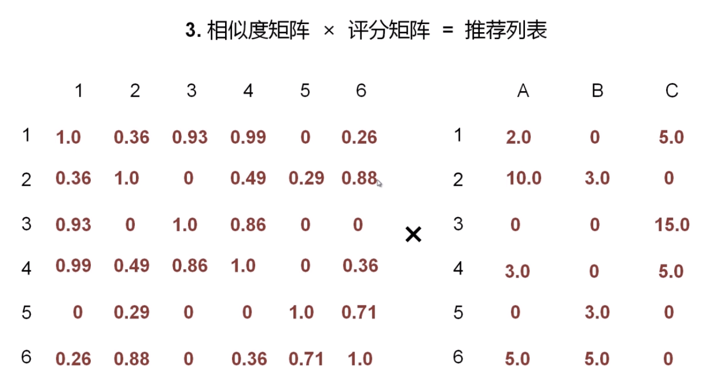

### Hadoop学习 
* 还有hive的学习,见Hive.md
* hbase的学习,见Hbase.md
* Spark/Flink/Beam入门,见Spark.md

#### 奇淫巧技
* 一个类可以实现CommandLineRunner接口,然后实现run()方法.该方法会在容器启动后最先被调用.  
如果有多个,调用顺序可以使用@Order指定

* IDEA远程调试
>
    运行
    java -Xdebug -Xrunjdwp:server=y,transport=dt_socket,address=8000,suspend=n -jar fuliqiu-0.0.1-SNAPSHOT.jar
    在本地的idea上选择 run -> edit configurations -> remote 输入ip和port即可 
>

#### bug
* 对于java api 8020端口,以及下载文件等,url前缀部分变为乱码(实为阿里云主机名)的bug.
>
    修改/etc/sysconfig/network 的hostname为hadoop000(也就是和配置在hosts中的自定义主机名,相同; 还不行则修改NETWORKING=yes)
    使用hostname命令查看当前主机名,使用hostname xxx命令修改当前主机名.
    在hosts中将 阿里云外网ip 映射到 hadoop000(自定义主机名) 即可.
>
* HDFS.API访问时,一直无法创建文件.报There are 1 datanode(s) run  错误.注意.和下面的错误数字不同.
暂时无法解决.当时如果不是远程访问是可以的.就此先作罢

* yarn的任务,无法查看其task,可能是HDFS的任务日志路径没有权限

* 云服务的外网ip无法直接在hosts上绑定主机名.需要hosts如下配置(该问题导致的webHSFS下载失败/启动时提示Cannot assign requested address等问题):
内网ip 要设置的主机名  
外网ip 任意主机名  

还需要在本地,也就是自己用来连接云服务器的电脑的hosts上,配置上hadoop000(要设置的主机名)为云服务器ip

* 阿里云的maven镜像可能会导致hadoop的maven依赖全部失效

* 如果使用java api创建文件时遇到:  
could only be replicated to 0 nodes instead of minReplication (=1) There are 0 datanode(s) run  
可以将hosts文件中配置的hadoop改为ip地址,而不是127.0.0.1

#### 发行版本 
* Apache Hadoop 开源 直接用它似乎也不错
* CDH：Cloudera Distributed Hadoop 商业的，一般用它  
cdh版本考虑的就是稳定和兼容
* HDP: Hortonworks Data Platform 安装费劲

#### HDFS（Hadoop Distributed File System） 分布式文件系统
将A文件拆分成若干个块存储在多台机器上，每个块可设置若干个副本，防止机器故障导致文件丢失。
如果不拆分存储，数据可能无法并行处理，文件过大也会成为网络瓶颈；
且各机器无法负载均衡；

#### YARN（Yet Another Resource Negotiator） 资源调度
负责整个集群资源的管理和调度。

#### MapReduce 并行处理框架
海量数据离线处理

#### HDFS
支持树形存储，也就是文件夹，文件这样。
Master/Slaves（主从，NameNode(NN)/DataNode/DN）架构;
1个文件被拆分成多个Block，默认是128M；

NN(NameNode)：负责客户请求的响应。元数据（文件拆分存储的索引等）的管理
DN(DataNode)：存储；定期向NN发送心跳信息，会报本身Block和健康信息

##### Hadoop伪分布式安装步骤-具体可查看hadoop官方文档
1. 安装JDK，注意该jdk一定要配置$JAVA_HOME,因为等下要在hadoop配置文件中配置java_home
2. 安装ssh
    * yum install ssh
    * 如果提示没有包可用，表示已经安装
    * 再配置免密登录-注意：如果是若干集群，就是主机A可以免密登录其他所有主机这样子
    * ssh-keygen -t rsa
    * 在目录中生成密钥文件/root/.ssh/id_rsa（注意，.ssh是隐藏文件夹，需要使用ls -la命令查看）
    * 并且将id_rsa.pub 内容复制给authorized_keys
    * cp ./id_rsa.pub ./authorized_keys 
    * 最后使用ssh localhost进行测试，如果不需要输入密码即可登录，表示成功
    * 如果失败,应该是权限问题,使用 chmod -R  777 /root 递归授权
3. 下载并解压hadoop
    * 去cdh网站下载 http://archive.cloudera.com/cdh5/cdh/5/
    * 解压：tar -zxvf hadoop-2.6.0-cdh5.7.0.tar.gz
4. hadoop配置文件修改(hadoop_home/etc/hadoop)
    hadoop-env.sh
        export JAVA_HOME=jdk路径(可以使用echo $JAVA_HOME 输出jdk路径)
5. 这是伪分布式，也就是一台机器上部署多个hadoop，所以在hsots中加入 hadoop000、001、002都指向127.0.0.1
6. 在 etc/hadoop/core-site.xml  中添加，分别是节点路径 和 临时文件位置
        <configutation>
            <property>
                <name>fs.defaultFS</name>
                <value>hdfs://hadoop000:8020</value>
            </property>
            <property>
                <name>hadoop.tmp.dir</name>
                <value>/zx/hadoop/tmp</value>
            </property> 
           
        </configutation>
        
   在 etc/hadoop/hdfs-site.xml 中添加,表示副本数
        <configuetctation>
            <property>
                <name>dfs.relication</name>
                <value>1</value>
            </property>
            <property>
                <name>dfs.data.dir</name>
                <value>file:/hadoop/data</value>
            </property>
            <property>
                <name>dfs.name.dir</name>
                <value>file:/hadoop/name</value>
            </property>
            <property>
                <name>dfs.datanode.address</name>
                <value>0.0.0.0:50010</value>
            </property>
            <property>
                <name>dfs.namenode.rpc-bind-host</name>
                <value>0.0.0.0</value>
            </property>

        </configutation>
        
        
   etc/hadoop/slaves 配置子节点,此处只需增加
        hadoop000
7. 格式化文件系统（仅第一次安装时）    
    在hadoop_home/bin中执行
        ./hadoop namenode -format 
    执行完成后，上面配置的临时文件位置也会生成临时文件
8. 启动HDFS -也可以直接将hadoop配置到环境变量中   
        export HADOOP_HOME=/zx/hadoop
        export PATH=${HADOOP_HOME}/sbin:$PATH 
        export PATH=${HADOOP_HOME}/bin:$PATH 
       进入/hadoop_home/sbin目录执行
            ./start-dfs.sh
       然后可以通过jps命令查看当前正在运行的java进程，可以看见,即表示成功：
            DataNode
            SecondryNameNode
            NameNode
       如果发生错误，在上面启动的时候会输出hadoop的日志路径，可以进入查看
       并且，成功后可以输入ip:50070 进入hadoop页面
9. 停止HDFS
        同样在/sbin目录下执行
            ./stop-dfs.sh
            
如果远程访问linux上的hadoop只有50070页面可以进入,8020端口无法访问,可以在hdfs-site.xml中如下配置:
>
    <property>  
        <name>dfs.namenode.rpc-bind-host</name>  
        <value>0.0.0.0</value>  
    </property>  
>
似乎其原因是50070监听的是0.0.0.0 50070,而8020监听的是127.0.0.1 8020 导致

10. 清空hdfs,删除hdfs-site.xml 和 core-site.xml中的临时文件夹所有数据,然后重新执行

11. 注意了.我因为一个could only be replicated to 0 nodes instead of minReplication (=1) bug浪费了一整个上午,  
其原因只是因为,我在阿里云服务器上hosts等地方配置的ip是127.0.0.1,而不是外网ip,导致我始终只能删除文件/添加文件夹,而无法  
添加文件.

12. 上面设置的副本系数,只有当使用默认的hdfs shell 传上去的文件才会生效;  
如果使用java api,没有设置副本系数,将使用hadoop默认的副本系数
##### Hadoop Shell命令行操作-具体可百度-也可以在上面的网页中直接浏览所有文件并下载
使用hadoop fs 或 hdfs dfs
* ls 例如 hadoop fs -ls / 表示查看根目录；   -ls -R可以递归查看文件，也就是查看所有文件 
* mkdir hadoop fs -mkdir -p /test/a/b 递归创建文件夹
* put  从本地放入hdfs，例如 hadoop fs -put test.text  /  表示将本地当前目录中的test.text放到hdfs中的根目录
* get 从hdfs到本地
* rm  -R 才能删除文件夹
* hadoop fs -text /test.text 查看hdfs中的该文件的内容

##### Hadoop Java API操作
添加依赖:
>
        <!--添加hadoop依赖-->
        <dependency>
          <groupId>org.apache.hadoop</groupId>
          <artifactId>hadoop-client</artifactId>
          <version>${hadoop.version}</version>
        </dependency>
>
默认仓库没有该包,添加仓库,注意,如果下载jar失败,把setting.xml中的阿里云镜像删除试试
>
    <repositories>
            <repository>
                <id>cloudera</id>
                <url>https://repository.cloudera.com/artifactory/cloudera-repos/</url>
            </repository>
        </repositories>

>
然后详见com.zx.HDFSTest类

* HDFS写入流程
    * 用户发起请求
    * hdfs客户端读取到配置的块大小和副本系数
    * 将大文件拆分成若干块
    * 依次向nameNode提交文件,
    * nameNode寻找空闲的若干个dataNode(根据副本系数确定)
    * 由dataNode存储数据,  
    一个dataNode收到数据的同时.会将数据备份到后续的dataNode上去(链)
    * 写完数据后,dataNode通知nameNode完成,然后进行下一个块的存储
    * 全部完成后,nameNode也就记录了所有数据块的存储位置
* HDFS读取流程
    * 用户发起请求
    * hdfs根据文件名信息,通过nameNode,获取到对应的块和快的位置
    * 从dataNode读取块
* 缺点:
    * 读写有延迟
    * 不适合小文件(因为小文件过多会对nameNode造成压力)

#### 资源调度框架YARN
可以让多个计算计算框架运行在同一个集群中,并共享同一个HDFS上的数据
* YARN架构
    * ResourceManager:  
        整个集群同一时间提供服务的只有一个,负责集群资源的统一调度  
        处理客户端的请求:提交作业,杀死作业  
        监控NodeManager,一旦节点宕机,那么宕机的任务需要通知ApplicationMaster进行处理
    * NodeManager:  
        整个集群有多个,负责自己节点的资源管理和使用  
        定时向ResourceManger汇报自身的资源使用情况  
        接收并处理来自ResourceManger的各种命令:启动Container  
        处理来自ApplicationMaster的命令
        单个节点的资源管理
    * ApplicationMaster:  
        每个应用程序对应一个(MR/SPARK),负责应用程序的管理  
        为应用程序向ResourceManger申请资源(core,memory),分配个内部task  
        与NodeManager通讯:启动/停止task,task运行在Container中,  
        ApplicationMaster也运行在Container中
    * Container:  
        任务运行环境的抽象
        封装了CPU/内存等资源的容器
    * Client:  
        提交作业/
        查看作业进度/
        杀死作业
* YARN执行流程
    * client提交作业
    * ResourceManager分配作业给NodeManager
    * NodeManager启动ApplicationMaster
    * ApplicationMaster向ResourceManager注册自己
    * 然后ApplicationMaster向ResourceManager申请各类资源,  
        然后在对应的NodeManager上启动Container
        
#### YARN环境搭建
* /etc/hadoop/yarn-site.xml
>
    <property>
        <name>yarn.nodemanager.aux-services</name>
        <value>mapreduce_shuffle</value>
    </property>
>
* mapred-site.xml(默认没有该文件,只有一个模版文件,需要拷贝一下:  
 cp mapred-site.xml.template mapred-site.xml)
>
    <property>
        <name>mapreduce.framework.name</name>
        <value>yarn</value>
    </property>
>

* 启动ResourceManager和NodeManager  
sbin/start-yarn.sh  
关闭
sbin/stop-yarn.sh

* 通过浏览器访问:默认 ip:8088

* jps查看到:ResourceManager和NodeManager

* 提交MapReduce作业到YARN上运行  
    * 官方提供的MapReduce例子:  
      /hadoop/share/hadoop/mapreduce/hadoop-mapreduce-examples-2.6.0-cdh5.7.0.jar
    * 执行(可以输入hadoop jar 或 hadoop jar xxx.jar 获取各阶段的命令帮助):  
        hadoop jar   
        hadoop jar hadoop-mapreduce-examples-2.6.0-cdh5.7.0.jar   
        hadoop jar hadoop-mapreduce-examples-2.6.0-cdh5.7.0.jar pi  
        hadoop jar hadoop-mapreduce-examples-2.6.0-cdh5.7.0.jar pi 2 3  
        此处是计算圆周率的例子,除此之外,将pi改掉,还有许多其他例子  
    * 在上面的浏览器页面中可以看见该任务的执行状况:  
    SUBMITED -> ACCEPTED -> RUNNING -> FINISHED
    
    
* jobhistory: YARN历史作业记录服务
    * 记录已经运行完的MapReduce信息到指定HDFS目录下
    * 默认是关闭的
    * hadoop/etc/hadoop/mapred-site.xml
        >
            <property>
              <name>mapreduce.jobhistory.address</name>
              <value>hadoop000:10020</value>
              <description>MapReduce JobHistory Server IPC host:port</description>
            </property>
            <property>
              <name>mapreduce.jobhistory.webapp.address</name>
              <value>hadoop000:19888</value>
              <description>MapReduce JobHistory Server Web UI host:port</description>
            </property>
            <property>
                <name>mapreduce.jobhistory.done-dir</name>
                <value>/history/done</value>
            </property>
            <property>
                <name>mapreduce.jobhistory.intermediate-done-dir</name>
                <value>/history/done_intermediate</value>
            </property>
            <!--临时文件路径-->
            <property>  
                <name>yarn.app.mapreduce.am.staging-dir</name>  
                <value>/user</value>  
            </property> 
        >
    * 进入 yarn-site.xml,修改如下:
        >
            <property>
                <name>yarn.log-aggregation-enable</name>
                <value>true</value>
            </property>
            <property> 
                <name>yarn.log.server.url</name> 
                <value>http://hadoop000:19888/jobhistory/logs/</value> 
            </property> 
            yarn-site.xml 不配置如下属性,会导致jobhistory启动时输出未开启日志聚合,导致查看历史作业日志时提示无可用.
            并且,jobhistory启动时输出的未开启日志聚合语句,是INFO级别..很难受.
            <property>
                <name>yarn.log-aggregation.retain-seconds</name>
                <value>186000000</value>
            </property>
        >
    * 在sbin目录使用./mr-jobhistory-daemon.sh start historyserver 启动
    * 然后在50070页面的已完成job处,点击history即可进入历史作业
    
    * 即可在历史job处查看各job的log
    * 可访问ip:19888/jobhistory 进入历史job页面
    * 该历史记录还有一个bug,就是从19888页面进入,点击logs的时候提示:  
    No logs available for container container_1512144759384_0001_01_000001  
    但是如果此时把url中  
    http://hadoop000:19888/jobhistory/logs/hadoop000:8042/container_1512144759384_0001_01_000001/job_1512144759384_0001/root  
    这个8042换成 35764,即可访问,这个35764似乎是随机的.具体可通过yarn8088页面访问logs的时候查看
    (使用apache hadoop 重新安装了一遍.似乎没问题了)
    
    
#### 分布式处理框架MapReduce
* 海量数据离线处理,无法实时流式计算
* 将作业拆分成Map阶段和Reduce阶段

* 该框架中的数据以key/value形式存储
* key和value都需要实现Writable接口  
(实现将自己输出到output中,或从inputStream中读取出自己这个对象的方法)
* key还需要实现WritableComparable接口,因为key是需要排序的

* (input) <k1, v1> -> map -> <k2, v2> -> combine -> <k2, v2> -> reduce -> <k3, v3> (output)  
以wordCount例子来说,K1:每个文件名;V1:每个文件中需要统计单词的单本内容;   
k2:单个文件中的每个单词;v2:单个文件中的每个单词出现的次数;  
K3:所有文件中的每个单词;V3:所有文件中每个单词出现的次数;  

核心概念  
Split：交由MapReduce作业来处理的数据块，是MapReduce中最小的计算单元  
	HDFS：blocksize 是HDFS中最小的存储单元  128M  
	默认情况下：他们两是一一对应的，当然我们也可以手工设置他们之间的关系（不建议）  

InputFormat：  
	将我们的输入数据进行分片(split):  InputSplit[] getSplits(JobConf job, int numSplits) throws IOException;  
	TextInputFormat: 处理文本格式的数据  
	FileInputFormat: 处理文件的数据  

OutputFormat: 输出  

* MapReduce1.X架构
1. JobTracker:JT
    作业管理者,将作业分解成一堆Task(MapTask和ReduceTask)  
    将作业分配给TaskTracker运行  
    作业的监控/容错处理(task挂了,重启task机制)  
    在一定时间内,JT未收到TT的心跳,TT可能挂了;  
    TT上的任务会被指派到其他TT上执行
2. TaskTracker:TT  
    任务的执行者  
    在TT上执行Task(MapTask和ReduceTask)  
    会与JT进行交互:执行/启动/停止作业.发送心跳给JT  
3. MapTask
    处理自己设置的Map任务  
    解析每条记录的数据,交给自己的map方法处理  
    将map的输出结果写到本地磁盘(有些作业只有map,没有reduce,交给HDFS)
4. ReduceTask
    将MapTask输出的数据进行读取  
    将数据分组传给reduce方法处理  
    输出结果到HDFS

* MapReduce2.X架构  
    就是上面写的YARN架构
    

* MapReduce的四个阶段
    * Split阶段 将文件的每行单词分割开来,输入给Map
    * Map阶段(需要编码) 统计每行每个单词出现次数,每出现一次就输出该单词和次数1
    * Shuffle阶段 将相同的单词归到一起,但不会进行次数累加
    * Reduce阶段(需要编码)

#### 单词统计 MapReduce
* 编写完成后打包.
* 使用如下命令运行: 后面分别是args[0] 和 args[1],也就是输入的路径和输出的路径  
hadoop jar /zx/Hadoop.jar com.zx.hadoop.mapreduce.WordCountApp hdfs://hadoop000:8020/zx/test/a.txt hdfs://hadoop000:8020/output/wordCount  

hadoop jar /zx/Hadoop.jar com.zx.hadoop.mapreduce.WordCountApp hdfs://hadoop000:8020/zx/test/a.txt hdfs://hadoop000:8020/output/wordCount
* 登录yarn监控页面查看状况
* 查看hdfs中输出的路径下的文件即可看见结果
* (第一次搞这么个东西出来,想想还有点小激动呢...)
* 使用mvc package -DskipTests命令可以跳过单元测试执行package

* Combiner
    * 本地的reducer
    * 减少map task输出的数据量及数据网络传输量
    * 在单词统计例子中,它会在本地先将所有相同单词的次数累加,  
        也就是x个key变成了一个key,然后再传输给reduce
    * 使用场景,求和/次数
* Partitioner
    * 决定MapTask输出的数据交由哪个ReduceTask处理
    * 默认实现: 分发的key的hash值对reduce Task的个数取模
    * 在实现它后,还需要设置reduceTask的个数,有多少个reduceTask,就会输出多少个输出文件.  
        例如part-r-0001这样
        

#### 用户行为日志分析
用户行为日志：用户每次访问网站时所有的行为数据（访问、浏览、搜索、点击...）  
用户行为轨迹、流量日志  

日志数据内容：  
1）访问的系统属性： 操作系统、浏览器等等  
2）访问特征：点击的url、从哪个url跳转过来的(referer)、页面上的停留时间等  
3）访问信息：session_id、访问ip(访问城市)等  

* 数据处理流程
1）数据采集(beats之类的都是可以的)
	Flume： web日志写入到HDFS

2）数据清洗
	脏数据
	Spark、Hive、MapReduce 或者是其他的一些分布式计算框架  
	清洗完之后的数据可以存放在HDFS(Hive/Spark SQL)

3）数据处理
	按照我们的需要进行相应业务的统计和分析
	Spark、Hive、MapReduce 或者是其他的一些分布式计算框架

4）处理结果入库
	结果可以存放到RDBMS(关系型数据库)、NoSQL

5）数据的可视化(还有阿里的一个收费的产品.页面贼科幻)
	通过图形化展示的方式展现出来：饼图、柱状图、地图、折线图
	ECharts、HUE、Zeppelin
	
* 离线数据处理架构

* 项目需求:统计慕课网主站访问日志的每种浏览器访问次数
    * 根据日志信息抽取出浏览器信息
    * 针对不同浏览器进行统计操作

* 抽取日志中的浏览器信息.github上有相关轮子.例如 UserAgentParser (https://github.com/LeeKemp/UserAgentParser)
    * 将该github上的项目下载到本地.打包到本地仓库.
    * 在pom.xml中添加依赖
    >
            <dependency>
              <groupId>com.kumkee</groupId>
              <artifactId>UserAgentParser</artifactId>
              <version>0.0.1</version>
            </dependency>
    >

* 课程中提供了1W条数据的nginx日志.可以使用如下命令抽出100条
> head -n 100 1000_access.log > 100_access.log

* 使用本次的单元测试统计每个浏览器的访问次数
>
String file = "C:\\Users\\97038\\Desktop\\10000_access.log";
        BufferedInputStream in = new BufferedInputStream(new FileInputStream(new File(file)));
        List<String> list = IOUtils.readLines(in, Encoder.UTF_8);
        UserAgentParser userAgentParser  = new UserAgentParser();

        //计数器
        final AtomicInteger i = new AtomicInteger();

        Map<String, Long> totalizerMap = new HashMap<>();

        //使用该并发流需要线程安全
        //像这样写的话.每次统计结果都会不一样
        list.parallelStream().forEach(item->{
            UserAgent agent = userAgentParser.parse(item);
            //浏览器
            String browser = agent.getBrowser();
            System.out.println(browser + " , " + agent.getEngine() + " , " + agent.getEngineVersion() + " , " +
                    agent.getOs() + " , " + agent.getPlatform() + " , " + agent.getVersion());

            Long totalizer = totalizerMap.get(browser);
            if (totalizer != null) {
                totalizerMap.put(browser,totalizer + 1);
            }else{
                totalizerMap.put(browser, 1L);
            }
            i.incrementAndGet();
        });
        System.out.println(i.get());
        for (Map.Entry<String, Long> item : totalizerMap.entrySet()) {
            System.out.println(item.getKey() + " : " + item.getValue());
        }
>    

* 编写MapReduce,见LogApp

* 因为解析的这个jar是本地的,所以需要maven插件将它打包到运行的jar中去,否则会找不到.  
插件
>
             <plugin>
                <artifactId>maven-assembly-plugin</artifactId>
                <configuration>
                    <archive>
                        <manifest>
                            <mainClass></mainClass>
                        </manifest>
                    </archive>
                    <descriptorRefs>
                        <descriptorRef>jar-with-dependencies</descriptorRef>
                    </descriptorRefs>
                </configuration>
            </plugin>
>
然后使用 mvn assembly:assembly命令打包
注意使用-DskipTests跳过测试

* 将日志文件上传到hdfs
* 然后将jar包也上传到云服务器
* 运行
hadoop jar /zx/Hadoop-1.0-SNAPSHOT-jar-with-dependencies.jar com.zx.hadoop.log.LogApp hdfs://hadoop000:8020/10000_access.log hdfs://hadoop000:8020/output/LogApp  

#### Hadoop分布式环境搭建 
* hadoop000: NameNode/DataNode ResourceManger/NodeManger
* hadoop001: DataNode NodeManager
* hadoop002: DataNode NodeManger

* hostname设置: vim /etc/sysconfig/network 每台机器需要设置自己的主机名
>
    NETWORKING=yes
    HOSTNAME=hadoop000
>

* hosts设置 每台机器都需要设置上集群所有机器的ip
>
    106.14.7.29 hadoop000
    106.14.7.28 hadoop001
    106.14.7.27 hadoop002
>

* 集群内的机器相互间都需要ssh免密登录

* 其他的见上面的伪分布式搭建.
    * 然后需要在yarn-site.xml中多添加
        >
            
            <property>
                <name>yarn.resourcemanager.hostname</name>
                <value>hadoop000</value>
            </property>
        >

    * 在etc/hadoop/slaves 配置整个集群
        >
            hadoop000       
            hadoop001       
            hadoop002       
        > 

* 注意, 对NameNode的格式化操作,只需要在需要作为NameNode使用的hadoop000上使用即可
  
* 启动集群,只需要在主节点上执行 sbin/start-all.sh 即可/ sbin-all.sh 停止

#### hadoop集成spring使用
1. 将普通maven项目变为springboot项目
>
    插件
    <plugin>
        <groupId>org.springframework.boot</groupId>
        <artifactId>spring-boot-maven-plugin</artifactId>
    </plugin>   
    
    不使用继承的方式
        <dependencyManagement>
            <dependencies>
                <dependency>
                    <groupId>org.springframework.boot</groupId>
                    <artifactId>spring-boot-dependencies</artifactId>
                    <version>1.5.9.RELEASE</version>
                    <type>pom</type>
                    <scope>import</scope>
                </dependency>
            </dependencies>
        </dependencyManagement> 
>

2. 导入依赖
>
    
        <dependency>
            <groupId>org.springframework.data</groupId>
            <artifactId>spring-data-hadoop-boot</artifactId>
            <version>2.5.0.RELEASE</version>
        </dependency>
>

3. 查看官方文档.获取到java代码配置的例子(教程上用的xml.实在受不了xml了.)
>
    @EnableHadoop
    @Configuration
    public class HadoopConfig extends SpringHadoopConfigurerAdapter{
    
        @Override
        public void configure(HadoopConfigConfigurer config) throws Exception {
            config
                    .fileSystemUri("hdfs://hadoop000:8020");
        }
    }
    
    或者直接在yml-这个目前还没详细弄
    spring:
      hadoop:
        fs:
          defaultFS: hdfs://hadoop000:8020
>

* 反正我不想用xml配置.于是就看了下..简陋的官方文档.也没有详细说怎么用FileSystem这个类.
    * 于是我就试着找了下FileSystemFactory之类的类.果然找到了FileSystemFactoryBean.
    * 然后我用idea的调用关系查询快捷键看过了.并没有帮我们创建它到spring bean
    * 于是我就在配置类中使用@Bean创建它.
    * 它需要一个Configuration类,注入.然后实现了InitializingBean接口,会在其他容器初始化完成后,如果
    有配置类,就使用该配置创建出一个FileSystem.如果没有.就默认连接本地的URI.创建对应的FileSystem
    * 因为hadoop配置类本身就实现了SpringHadoopConfigurerAdapter,并且我重写了configure()方法.
    所以我觉得Configuration类应该默认就加入bean了的.于是就像下面这么写.
    >
          @Autowired
            private org.apache.hadoop.conf.Configuration configuration;
        
            @Bean
            public FileSystemFactoryBean fileSystemFactoryBean() {
                FileSystemFactoryBean fileSystemFactoryBean = new FileSystemFactoryBean();
                fileSystemFactoryBean.setConfiguration(configuration);
                fileSystemFactoryBean.setUser("root");
                return fileSystemFactoryBean;
            }
    >
    * 然后,就可以直接注入FileSystem了
    >
          @Autowired
            private FileSystem fileSystem;
    > 
    * 和之前未整合spring的一样使用即可.但居然会抛出一个  
    java.io.IOException: Could not locate executable null\bin\winutils.exe in the Hadoop binaries.  
    虽然并不影响使用....查看异常堆栈.可以看到是没有配置环境变量导致..
    >
             // construct hadoop bin path to the specified executable
             String fullExeName = HADOOP_HOME_DIR + File.separator + "bin" 
               + File.separator + executable;
         
             File exeFile = new File(fullExeName);
             if (!exeFile.exists()) {
               throw new IOException("Could not locate executable " + fullExeName
                 + " in the Hadoop binaries.");
             }
             
             在更往上的方法里.他尝试获取目录
             // first check the Dflag hadoop.home.dir with JVM scope
                 String home = System.getProperty("hadoop.home.dir");
             
                 // fall back to the system/user-global env variable
                 if (home == null) {
                   home = System.getenv("HADOOP_HOME");
                 }
    >
    
    * 还可以直接使用FsShell(注意是boot data啥的包下的)
    >
            @Autowired
            private FsShell fsShell;
        
            @Override
            public void run(String... strings) throws Exception {
                for (FileStatus fileStatus : fsShell.lsr("/output")) {
                    System.out.println(">" + fileStatus.getPath());
                }
            }
    >  
    
    * 在使用我自己的方法注入FileSystem,并注入FsShell后,引发了循环依赖bean的异常.
  
    

#### Hadoop分布式缓存
在执行MapReduce时,可能需要在Mapper之间共享一些信息,如果信息不大,可以将其从HDFS加载到内存中,这就是Hadoop分布式缓存机制
* 第一步-将一个文件添加到缓存中去,以便在map阶段使用,可以直接使用# + 文件别名,使用

* 第二步,在Map或Reduce的setup方法中获取缓存的文件输入流

* 加载缓存到内存发生在job执行之前,每个节点各自缓存一份相同的共享数据.如果共享数据太大,可以将共享数据分批缓存,重复执行作业

#### Hadoop3.x新特性
* Common(hadoop通用组件)
    * shell脚本重写,但保证了兼容性
* HDFS
    * 支持消除编码(Erasure Coding)替换副本机制(缺点:冷门文件也是保存同样个数的副本,占用空间).
    * 支持2个以上的NameNodes
    * DataNode的平衡功能,例如新加一台机器,可以让新旧机器的文件量平衡
    * 多个服务默认端口发生变化.
* 详细的自行查看官方文档

#### 推荐算法
* 余弦相似度
* 基于物品的协同过滤推荐算法(ItemCF)
    * 用户行为与权重:点击1分.搜索3分,搜索5分.付款10分.这样表示用户行为的权重
    
    * 根据用户/物品权重矩阵计算物品与物品的相似度矩阵
    
    * 相似度矩阵 ✖ 评分矩阵 = 推荐列表
    
    * 推荐列表和评分矩阵(用户对某个商品的行为权重)
    
    * 将用户行为列表作为输入文件
    
学不动.. 需要的时候再看吧.

    

    
    
    

  

